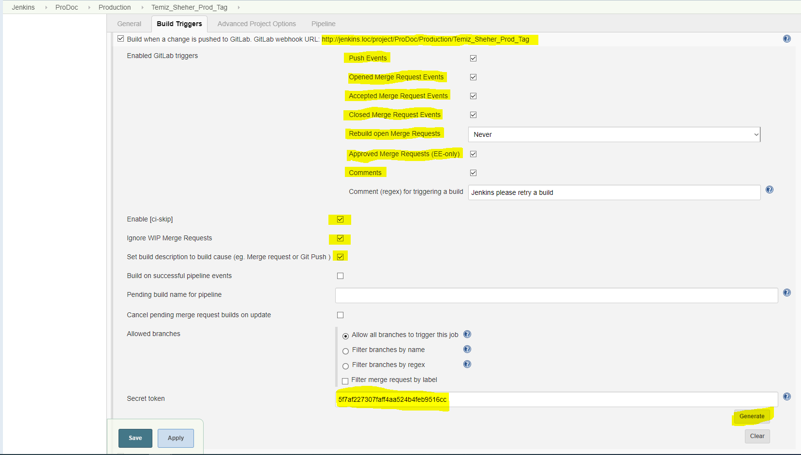
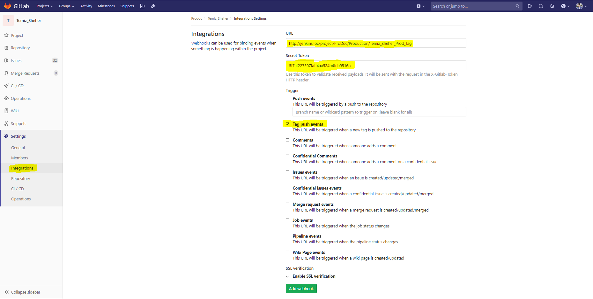
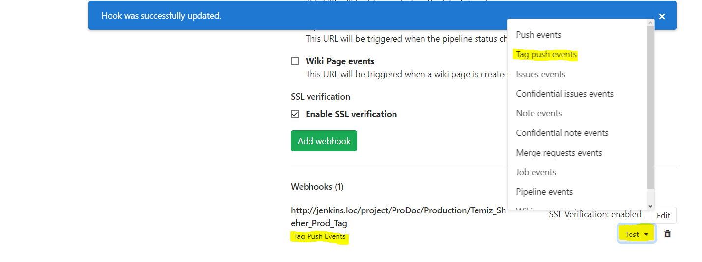
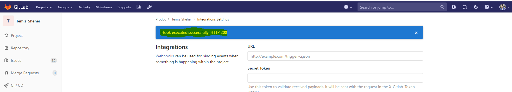
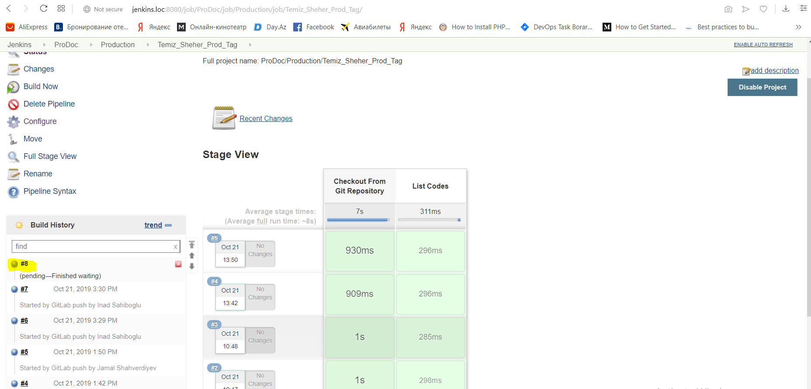
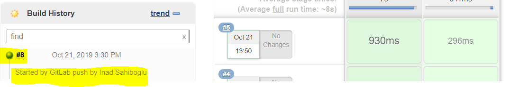

## Webhook Configuration and Usage Between Gitlab And Jenkins

### Firstly, we should generate project based secret token on the configuration section of a Jenkins job and select all relevant options for the webhook to work as shown below.(We will take Secret token and the URL to do configurations on Gitlab side later").

### Now let's go to Gitlab project and add webhook based on "Tag push events" using the jenkins project URL and jenkins project secret token that we generated. Each step has been shown in the picture below.

### After adding the webhook, we can test the webhook.

### After testing, we will see that Gitlab will trig the Jenkins job to run. Images have been shown below.

