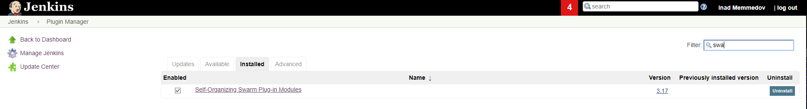

## Introduction To Swarm Plugin

````bash
This plugin enables slaves to auto-discover nearby Jenkins master and join it automatically:

````

### We can install the plugin from plugin center (Jenkins->Manage Jenkins->Manage Plugins) on Jenkins Master:


### In our case, swarm plugin is already installed, but if not installed we can install it from Available section shown in the picture below:




### Do not forget to change the "TCP port for inbound agents" to Random for JNLP in Jenkins Security section(Jenkins->Manage Jenkins->Configure Global Security):


### After configuring everything on Jenkins Master side, we can go to slave servers to install and run swarm clients:

#### Firstly we should install java on client machines, for installing you can refer to the link shown below:


- [Installing Java on Centos7 System](https://progit.tk/devops/java/blob/master/Centos7OpenJDK18.md)
- [Installing Java on Debian9 System](https://progit.tk/devops/java/blob/master/Debian9OpenJDK18.md)

#### In order to install and run swarm clients we should run the "joinToMaster.sh" bash script, the reference link has been shown below:

- [joinToMaster.sh](https://progit.tk/devops/bash-codes/blob/master/jenkins_scripts/joinToMaster.sh)

#### As you will see, the script will accept 5 arguments:

##### The arguments are:
````
1. JenkinsDomainOrIP: The domain or ip of jenkins master server
2. JenkinsSrvUser:  The user created for clients to login to the system and add themselves as slave
3. JenkinsSrvPass: The password for the created user
4. SlaveName: Name of the slave
5. ExecuterCount: The count of executors

````

#### Finally we can run our bash script:

````bash
$ ./joinToMaster.sh jenkins.loc slave slave12345 Debian/Centos 4
````
