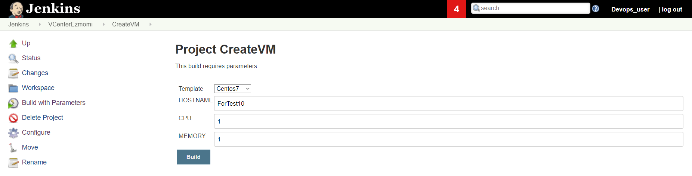

# In this Readme file, you will learn how to install/configure ezmomi and then use it
---
### For Installation we will use the commands shown below

- 1. Installing ezmomi and python (2.7) packeges that are required for ezmomi

````bash
# pip install --upgrade pip
# pip install requests
# pip install pyvmomi
# pip install ezmomi
# pip install virtualenv
````

- 2. Create Virtual Environment for Ezmomi (Python 2.7)
````bash
# cd /root
# virtualenv --no-site-packages  ezmomi_env
# source ezmomi_env/bin/activate
# pip install requests
# pip install pyvmomi
# pip install ezmomi
# deactivate
````

 - 3. Zipping and Backup Ezmomi Environment for future use

````bash
# tar -jcvf ezmomi_env.tar.bz2 --absolute-names ezmomi_env/ 
````

### Configuration of Ezmomi

By default ezmomi looks for the file named .config.yml, this file resides under ~/.config/ezmomi/config.yml

- 1. In order to create the folder use the command below:

````bash
# mkdir -p ~/.config/ezmomi
````

 - 2. The content of config.yml file:
````
# config.yml
# ezmomi

# Mail setup for notifications
mail: true
mailserver: localhost
mailfrom: jamal.shahverdiev@example.com
mailto: jamal.shahverdiev@example.com

# vCenter connection settings
server: VCenterIP
port: 443
username: VCenterUsername
password: VCenterPassword

# New VM defaults
#cpus: 4
#mem: 2
domain: example
dns_servers: ['8.8.8.8','8.8.4.4']
#template: Centos7
# List your networks here
networks:
  '192.168.222.0/24':
     datacenter: 'Devops_ESXI'
     datastore: 'Templates'
     cluster: 'Devops_Cluster'
     network: 'Templates'
     gateway: '192.168.222.1'

````
### Simple Ezmomi commands example: 
```bash
# ezmomi list --type Datastore
# ezmomi list --type VirtualMachine
# ezmomi clone --server 172.16.166.166 --template 'Centos7' --hostname 'Test_VM' --ips 192.168.222.50 --destination-folder "/Devops_ESXI/vm"  --cpus 2 --mem 4
#
```

### Using Jenkins in order to create VM in our VCenter

Input the relevant parameters and build the project, do not forget to take a look at the console output in order to see the IP Address of the created host:




